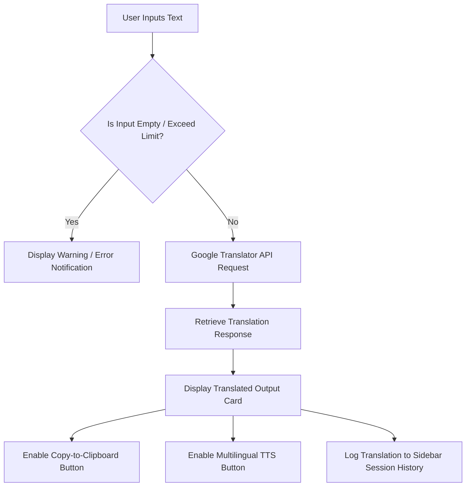

# 🌅 AuroraTranslate - Premium Multi-Language Translation Tool

AuroraTranslate is a professional, production-ready, fully functional translation web application. It integrates dynamic language indexing, seamless API-based translation, and native client-side voice synthesis with a modern glowing Cyber Sunset UI.

---

## 🌟 Features

1. **Robust Translation Engine**:
   - Integrates the free, zero-credential Google Translate API wrapper via `deep-translator`.
   - Supports translation between **over 100 languages**.
   - Includes **Auto-Detect** functionality to identify source languages automatically.
2. **Dynamic UI/UX (Cyber Sunset Theme)**:
   - High-fidelity dark mode styling using Google Fonts (`Outfit`).
   - Glowing gradient accents (Aurora Red to Purple).
   - Sidebar metrics dashboard displaying translation statistics and status.
3. **Smart Language Controls**:
   - One-click **Swap** button to swap source and target languages and transfer text inputs.
   - Built-in character counter with boundaries (max 5000 chars) to prevent API timeouts.
4. **Browser-Based Text-to-Speech (Voice Output)**:
   - Native client-side speech synthesizer using the HTML5 Web Speech Synthesis API.
   - Speech output matches the target language accent (e.g., Spanish voice for Spanish text, Japanese voice for Japanese text).
   - "🔊 Speak" button updates to "Speaking..." during audio synthesis.
5. **Instant Copy to Clipboard**:
   - One-click copy button that leverages the browser's native Clipboard API with active "Copied!" validation.
6. **Translation Logging & Management**:
   - Saves translation logs in the sidebar in real time.
   - Allows users to clear session logs or export translation history as `.txt` files.
7. **Quick Test Prompt Chips**:
   - One-click suggested prompts to instantly test translation operations.

---

## 🛠️ Technologies Used

| Technology / Library | Purpose | Category |
| :--- | :--- | :--- |
| **Python 3.8+** | Core Programming Language | Platform |
| **Streamlit** | Interface Layout, Dropdowns, Sidebar, Web Server | Frontend UI |
| **Deep-Translator** | Connection with Translation APIs | Machine Translation |
| **HTML5 Web Speech API** | Local client-side Speech Synthesizer | Multimedia |
| **Clipboard API** | Native text copy utility | Frontend Operations |
| **Vanilla CSS** | Translucent glassmorphism styling, animations, and gradients | Styling |

---

## 📐 System Architecture & Flow



---

## 📁 Project Directory Structure

```directory
translation_tool/
│
├── app.py                # Core Streamlit Web Application & API Logic
├── requirements.txt      # Python Package Dependencies
└── README.md             # Project Documentation (This File)
```

---

## 🚀 Installation & Local Execution

### Prerequisites
Make sure you have **Python 3.8 or higher** installed. Check your version with:
```bash
python --version
```

### Step 1: Clone or copy the project files
Create a dedicated project directory and copy the core files (`app.py`, `requirements.txt`, `README.md`, `.gitignore`) into it.

### Step 2: Establish a Virtual Environment (Recommended)
Navigate into the directory and create a Python virtual environment:
```bash
# Windows
python -m venv venv
venv\Scripts\activate

# macOS / Linux
python3 -m venv venv
source venv/bin/activate
```

### Step 3: Install Core Dependencies
Use Python's package manager to install the required libraries:
```bash
pip install -r requirements.txt
```

### Step 4: Launch the Translator Server
Start the Streamlit dev-server by executing:
```bash
streamlit run app.py
```
Streamlit will automatically open your web browser to the application local address:
```text
http://localhost:8501
```
